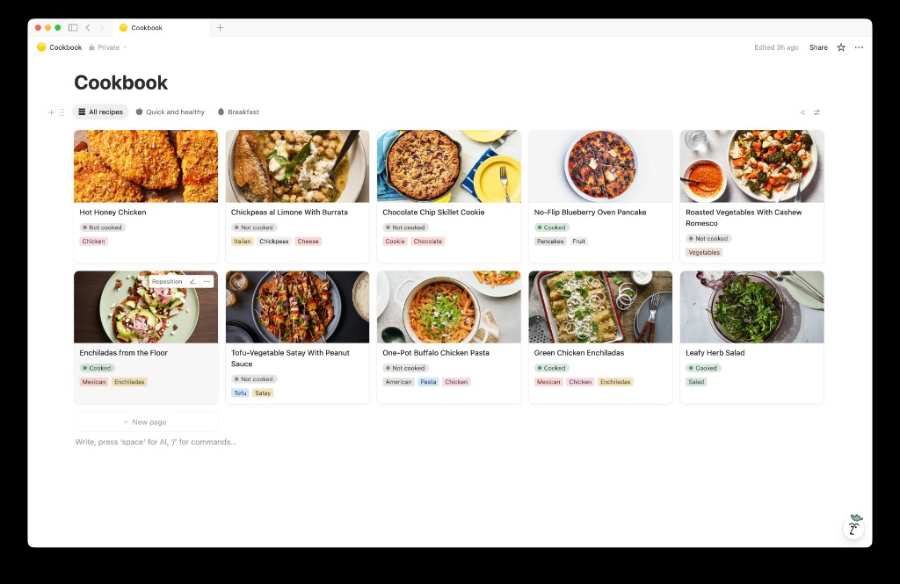
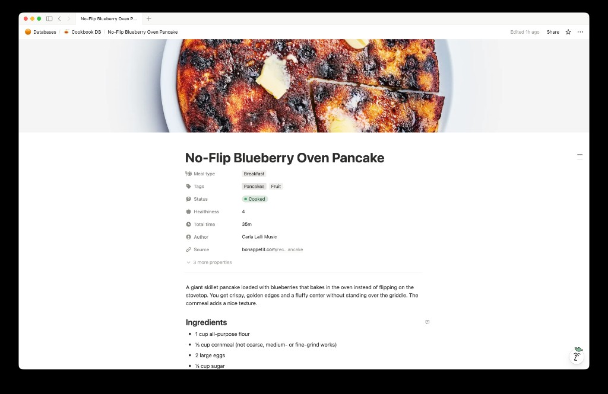

# recipe-to-notion

A CLI tool that scrapes a recipe URL, generates AI scores and tags with Claude, and saves it to a Notion database with a cover photo and structured content.





## How It Works

```
URL → Check duplicates → Scrape recipe (JSON-LD) → Claude scores/tags → Notion page
```

1. **Check Duplicates** — Before processing, checks if a recipe with the same URL or title already exists in your Notion database. If found, the tool rejects the duplicate and provides a link to the existing recipe.

2. **Scrape** — Fetches the page HTML and extracts structured recipe data from [JSON-LD](https://json-ld.org/) (`schema.org/Recipe`). Most recipe sites embed this for SEO, including paywalled sites like NYT Cooking. If JSON-LD isn't available, falls back to microdata attributes and common CSS class patterns.

3. **Tag** — Sends the recipe name, ingredients, and instructions to Claude (`claude-sonnet-4-5-20250929`), which returns:
   - **Tags** — 1-4 tags for cuisine, dish type, and main ingredient (e.g. Italian, Pasta, Chicken)
   - **Meal type** — Breakfast, Lunch, Dinner, Snack, Dessert, Appetizer, Side Dish, or Component
   - **Healthiness** — 0-10 scale (0 = junk food, 10 = balanced whole-food meal)
   - **Minutes** — Total time estimate (uses scraped value if available, otherwise AI estimates)
   - **Description** — Brief 2-3 sentence summary of the dish

4. **Save** — Creates a Notion page in your database with:
   - All properties filled in (name, URL, author, time, scores, tags)
   - The recipe's hero image as the page cover
   - AI-generated description at the top of the page body
   - Ingredients as a bulleted list
   - Instructions as a numbered list

## Prerequisites

- [Bun](https://bun.sh/) runtime installed
- An [Anthropic API key](https://console.anthropic.com/)
- A [Notion integration](https://www.notion.so/my-integrations) with a connected database

## Setup

### 1. Clone and install

```bash
cd ~/recipe-to-notion
bun install
```

### 2. Create a Notion integration

1. Go to [notion.so/my-integrations](https://www.notion.so/my-integrations) and create a new integration.
2. Copy the **Internal Integration Secret** (starts with `ntn_`).

### 3. Create a Notion database

Create a new full-page database in Notion. You can add the required properties manually:

| Property    | Type         | Description                    |
|-------------|--------------|--------------------------------|
| Name        | Title        | Recipe name                    |
| Source      | URL          | Link to original recipe        |
| Author      | Rich text    | Recipe author (if available)   |
| Minutes     | Number       | Total time in minutes          |
| Tags        | Multi-select | e.g. Italian, Pasta, Chicken   |
| Meal type   | Multi-select | e.g. Dinner, Snack             |
| Healthiness | Number       | 0-10                           |

### 4. Connect the integration to your database

1. Open the database page in Notion.
2. Click the `...` menu in the top-right corner.
3. Under **Connections**, find and add your integration.

### 5. Get your database ID

The database ID is the 32-character hex string in the database URL:

```
https://www.notion.so/yourworkspace/DATABASE_ID_HERE?v=...
```

Copy just the ID portion (with or without dashes).

### 6. Configure environment variables

Copy the example file and fill in your keys:

```bash
cp .env.example .env
```

Edit `.env`:

```
ANTHROPIC_API_KEY=sk-ant-...
NOTION_API_KEY=ntn_...
NOTION_DATABASE_ID=abc123...
```

### 7. (Optional) Initialize database properties

The tool will work with manually created properties, but you can also programmatically ensure your database has all required properties using the `setupDatabaseViews` function from `src/notion.ts`. This creates any missing properties and pre-populates the Meal type multi-select options.

## Usage

```bash
# Single recipe
bun src/cli.ts https://cooking.nytimes.com/recipes/1234-example

# Multiple recipes
bun src/cli.ts url1 url2 url3
```

When processing multiple URLs, each is processed sequentially. Failures (duplicates, scraping errors) don't stop execution - all URLs are attempted.

### Example output

```
◐ Checking for duplicates...
✔ No duplicate URL found
◐ Scraping recipe...
✔ Scraped: Chicken Tikka Masala
◐ Generating AI scores and tags...
✔ Tagged recipe

Chicken Tikka Masala
Author:      Melissa Clark
Tags:        Indian, Curry, Chicken
Meal type:   Dinner
Healthiness: 6/10
Minutes:     45
Ingredients: 18 items
Steps:       8 steps

◐ Saving to Notion...
✔ Saved to Notion: https://www.notion.so/abc123def456...
```

### Duplicate Detection

The tool automatically checks for duplicate recipes before processing. If a recipe with the same URL or title already exists, it will:

- Display an error message with the existing recipe's title and source URL
- Provide a clickable link to view the existing recipe in Notion
- Exit without adding the duplicate

This prevents duplicate entries and saves API costs by checking before scraping and tagging.

## Recommended Notion Views

After adding a few recipes, create these views in your Notion database for a better browsing experience:

1. **Gallery** — Gallery view showing cover photos with Name, Tags, and scores visible.
2. **Quick Meals** — Table view filtered to `Minutes ≤ 30`, sorted by Minutes ascending.
3. **Healthiest** — Table view sorted by Healthiness descending.
4. **By Tags** — Board view grouped by Tags.
5. **By Meal type** — Board view grouped by Meal type.

## Building a standalone binary

```bash
bun build src/cli.ts --compile --outfile recipe-to-notion
./recipe-to-notion https://example.com/recipe
```

## Project Structure

```
src/
├── cli.ts             CLI entry point (commander + consola logging)
├── index.ts           Orchestrator connecting scrape → tag → save
├── scraper.ts         Recipe extraction (JSON-LD primary, cheerio fallback)
├── tagger.ts          Claude API for tags, healthiness, meal-type, time, description
├── notion.ts          Notion page creation, duplicate detection, and database schema setup
├── config.ts          Environment variable loading with zod validation
└── system-prompt.md   Claude system prompt for recipe analysis
```
