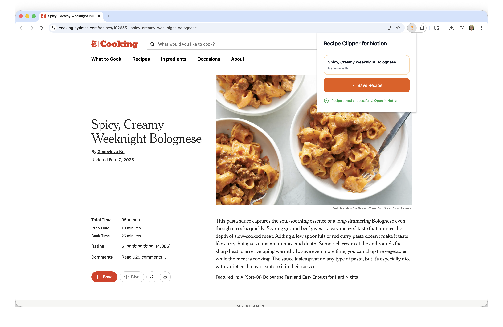
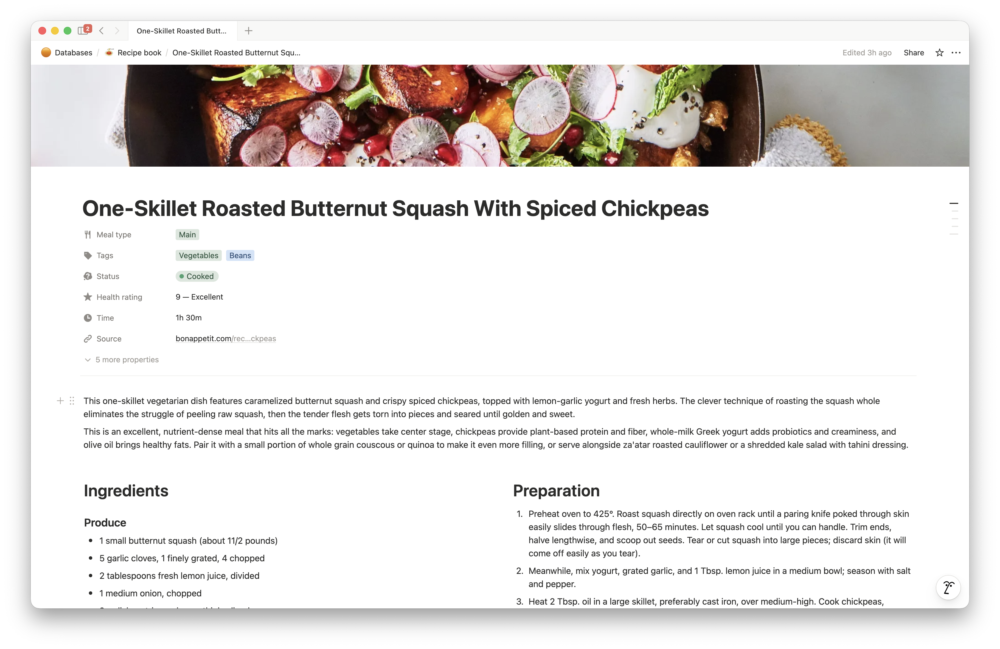

<p align="center">
  
</p>

# Recipe Clipper for Notion

Save recipes to Notion without copying and pasting. Input a URL from almost any recipe site and get a Notion page with the cover photo, ingredients grouped by shopping aisle, instructions, and AI-generated tags. Claude automatically analyzes each recipe to add cuisine tags, meal types, health scores, ingredient categories, and a short description, so you can filter and search your collection later.


*Browser extension popup showing recipe save progress*


*Recipe collection in Notion with AI-generated tags*


*Individual recipe page with ingredients, instructions, and AI-generated description*

## 📚 Documentation

| Guide | Description |
|-------|-------------|
| **[Setup](docs/SETUP.md)** | Initial setup, local development, and configuration |
| **[Deployment](docs/DEPLOYMENT.md)** | Deploy to Vercel |
| **[Clients](docs/CLIENTS.md)** | Browser extension, web interface, iOS shortcut, and CLI |
| **[API Reference](docs/API.md)** | REST API for custom integrations |
| **[System Prompt](backend/system-prompt.md)** | Claude AI instructions for recipe tagging |

## ⚙️ How It Works

```
CLI/Extension/Web/API/Shortcut → Check duplicates → Scrape recipe → Claude scores/tags → Notion page
```

1. **CLI/Extension/Web/API/Shortcut** — Recipe URL is provided via CLI command, browser extension click, web interface, HTTP API request, or iOS Shortcut.

2. **Check duplicates** — Before processing, checks if a recipe with the same URL or title already exists in your Notion database. If found, the tool rejects the duplicate and provides a link to the existing recipe.

3. **Scrape recipe** — Sends the page HTML to the Python `recipe-scrapers` library which extracts structured recipe data. Supports 600+ recipe sites including NYT Cooking, Bon Appétit, AllRecipes and many more.

4. **Claude scores/tags** — Sends the recipe to Claude, which returns tags, meal type, health score (1-10), time estimate, description, and ingredient categories grouped by shopping aisle.

5. **Notion page** — Creates a Notion page with all properties, cover image, AI description, ingredients grouped by shopping category, and numbered instructions.

## 💰 Cost

Each recipe costs roughly **2-3 cents** in Claude API usage (roughly 4,300-5,300 input tokens and 400-1,000 output tokens per recipe). The default model is Sonnet 4.5, but you can change it by setting the `CLAUDE_MODEL` environment variable to `"haiku"`, `"sonnet"`, or `"opus"`.

**Prompt caching:** When you save multiple recipes within 5 minutes, subsequent recipes cost significantly less (~1¢ each vs ~2¢) because Claude caches the system prompt. For example, saving 10 recipes in quick succession costs about **11¢ total** instead of ~21¢ without caching.

> **Note:** The Notion API and Vercel hosting are free for personal use, so there are no additional costs beyond the Claude API usage.

## 🛠️ Technologies

- [Anthropic SDK](https://docs.anthropic.com/en/api/client-sdks) - Claude AI API client
- [Notion SDK](https://github.com/makenotion/notion-sdk-js) - Notion API client
- [recipe-scrapers](https://github.com/hhursev/recipe-scrapers) - Recipe extraction
- [Bun](https://bun.sh/) - JavaScript runtime
- [Solid.js](https://www.solidjs.com/) - Reactive UI framework
- [Zod](https://zod.dev/) - Schema validation
- [Vercel](https://vercel.com/) - Serverless hosting
- [Tailwind CSS](https://tailwindcss.com/) - CSS framework
- [Citty](https://github.com/unjs/citty) - CLI argument parsing
- [Biome](https://biomejs.dev/) - Linting & formatting

## 🙏 Credits

Icon attribution: <a href="https://www.flaticon.com/free-icons/cutlery" title="cutlery icons">Cutlery icons created by Freepik - Flaticon</a>

